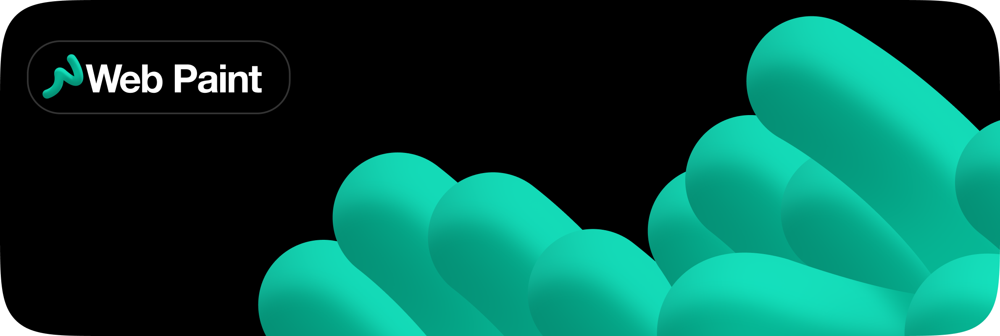
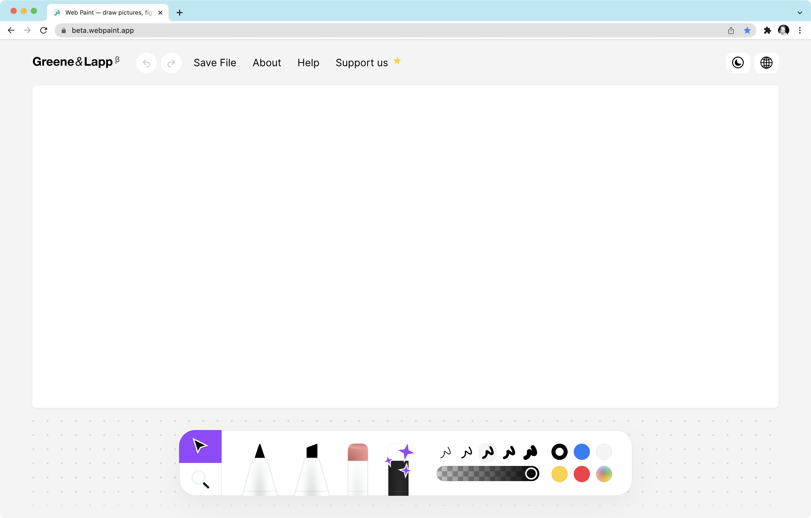

### Meet a Web Paint

Web Paint is a minimalistic graphics editor in the browser. Draw pictures, figures, enhance your fantasy with Web Paint based on classic Microsoft Paint. Web Paint is available for mac, linux, windows, ios, android.

## Key Features

Web Paint contains these features like drawing figures with editable stroke width, vector zoom, two types of&nbsp;markers on&nbsp;current version, and a&nbsp;'erase all' tool with an&nbsp;eraser in&nbsp;the dock.

### Team

Idea by Greene & Lapp studio.
- Designed by [Alexander Greene](https://t.me/greeneboy)
- Developed by [Platon Lapp](https://t.me/SeamMiner)

### Stack
- Vue js — The Progressive JavaScript Framework.
- TypeScript — strongly typed programming language that builds on JavaScript, giving you better tooling at any scale.
- PWA — web apps that use service workers, manifests, and other web-platform features in combination with progressive enhancement to give users an experience on par with native apps.


### Curren version • 0.2.1



## Project setup
```
yarn install
```

### Compiles and hot-reloads for development
```
yarn serve
```

### Compiles and minifies for production
```
yarn build
```

### Lints and fixes files
```
yarn lint
```

### Customize configuration
See [Configuration Reference](https://cli.vuejs.org/config/).
